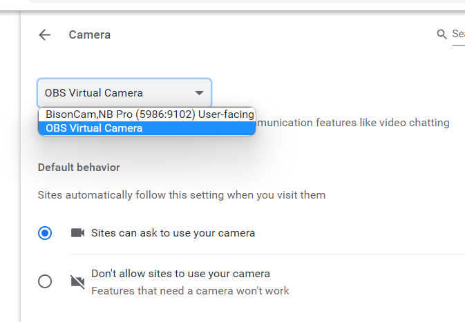
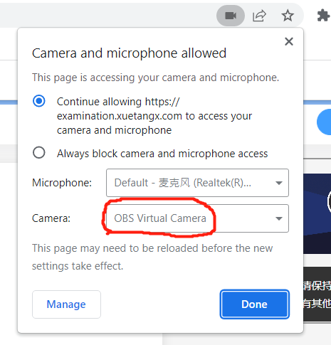
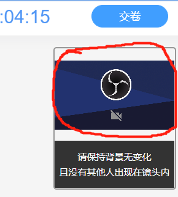
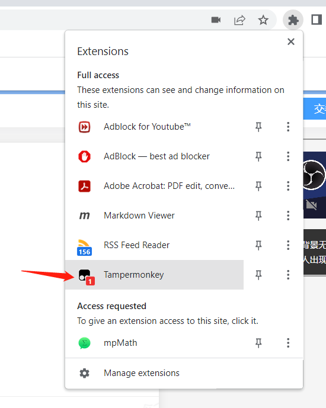
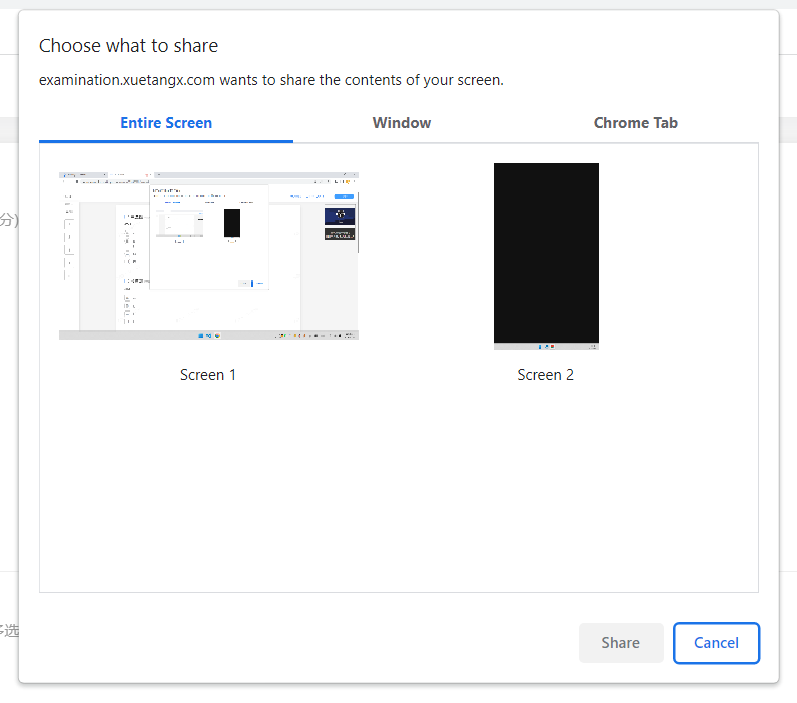
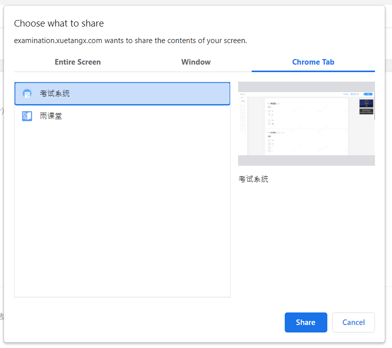
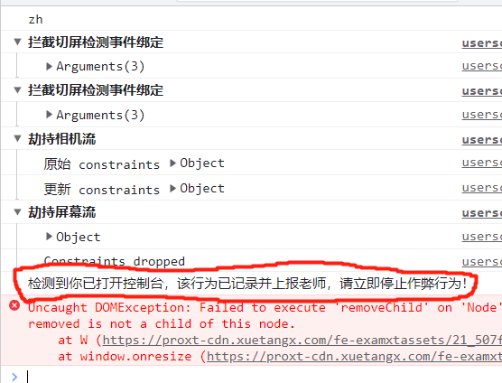

# 雨课堂考试 Hack

## 功能

- [x] 拦截切屏检测
- [x] 允许使用虚拟摄像机
- [x] 解除共享屏幕的限制

## 安装

发布路径：https://github.com/CUC-Life-Hack/rainclass-exam-hack/blob/master/dist/main.user.js

安装方法：请参阅 [TamperMonkey 使用说明](https://github.com/CUC-Life-Hack/.github/wiki/Tampermonkey-%E4%BD%BF%E7%94%A8%E8%AF%B4%E6%98%8E)。

## 使用

**阅读本脚本说明前请先阅读[雨课堂在线考试指南](https://github.com/CUC-Life-Hack/exam-tricks/wiki/%E9%9B%A8%E8%AF%BE%E5%A0%82%E5%9C%A8%E7%BA%BF%E8%80%83%E8%AF%95)，以了解可能的准备工作。**

此脚本用于主设备的雨课堂考试页面，通过劫持脚本环境来绕过考试系统的限制。
最好用于 Chrome 浏览器上。

### 使用虚拟摄像机

要在主设备使用虚拟摄像头，你需要事先准备一段适当长度的视频。
这段视频有两个目的：一、通过考前身份校验；二、糊弄监考教师。
视频内容大概就是<u>“你坐在电脑前答题”</u>，视角是电脑摄像头。

配置好 OBS 后，在浏览器的设置中将默认相机设为 OBS 的虚拟摄像机。

> 对于 Chrome 浏览器，设置页在[这里](chrome://settings/content/camera)。

这样，考试系统就只能获取到虚拟摄像机了。

> 图里的摄像机没有内容是因为我没开 OBS，真正考试的时候记得开……

对于副设备，可以采取同样的操作，只不过要符合考试规范里要求的机位设定。
切记，如果副机位不符合要求，**可能会在考试时被要求调整**。

### 开始考试后

在**进入考试页面后**（即看到试题后）刷新页面，打开浏览器的插件浮窗。
若脚本正确激活，顶部栏里的 TamperMonkey 会显示数字角标：

如果没激活，你可以关闭考试页面来检查哪里出了问题。
当然，这是在你的副设备不会出卖你的前提下（比如没要求副设备/副设备采用了虚拟摄像头的情况）。
或者你可以直接开始考试（这样就相当于正常考试了，因为脚本压根没生效）。

### 应对切屏检测

此脚本会自动屏蔽切屏检测。

### 应对屏幕抓取

如果你的试卷命题教师要求在考试过程中抓取屏幕，那么你会看到这样的弹窗：

不要按官方指导里说的那样直接分享整个屏幕，切换至“标签页”选项卡，只分享考试标签页即可。

本脚本会劫持分享区域类型的检测，欺骗考试系统让它以为这是整个屏幕。
因此在选择分享标签页后，系统不会再弹窗告警。

### 最终效果

确认你的主设备和副设备都采用了虚拟摄像机提供的视频片段；

确认此脚本已启用；

确认你的屏幕分享范围仅仅局限在考试页面里（而不是整个屏幕）；

此时，你可以在考试标签页外为所欲为，而在监考老师的视角里（不管是雨课堂后台还是副设备挂着的腾讯会议），你永远都在认真答题。

> 注意不要一时得意忘形取消了屏幕分享。

## 其他

搞笑的是，在开发考试页的外挂脚本时，在控制台看到了这行输出：

然而实际考察了代码后，发现这是个纯纯吓唬人的稻草人。
（和同学模拟考试时负责监考的同学也反应“根本没有打开控制台的告警”）
